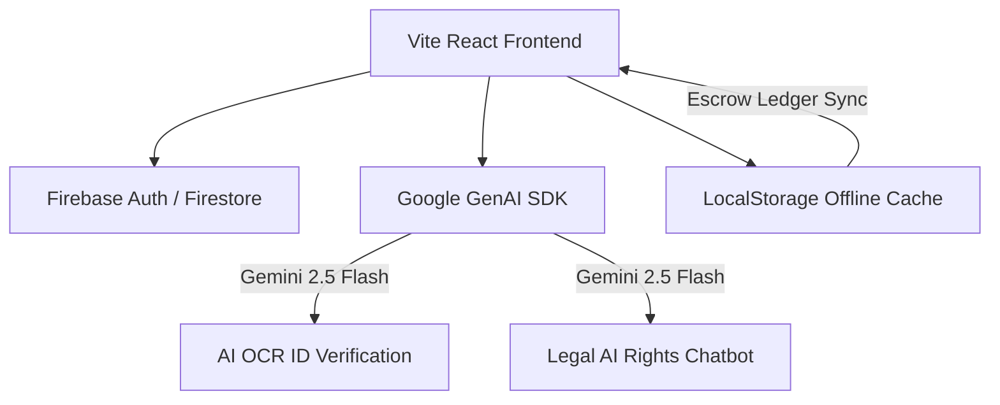

# ⚡ LOKLINK
### Hyperlocal Informal Worker Empowerment Platform (Hubballi-Dharwad / Karnataka Context)

*An elite, full-stack React + TypeScript + Vite showcase application designed to bridge the digital divide for blue-collar specialists, daily wage laborers, and street vendors in India.*

[](https://react.dev)
[](https://www.typescriptlang.org)
[](https://vitejs.dev)
[](https://deepmind.google/technologies/gemini)
[](https://firebase.google.com)

</div>

---

## 📖 Project Overview

In India, millions of informal laborers (plumbers, carpenters, domestic cooks, painters, loaders) lack a digital footprint, leaving them vulnerable to middleman exploitation, unsafe working conditions, and payment withholding. 

**LOKLINK** is a state-of-the-art community coordination system that empowers local gig-workers with robust tools:
- **Generative AI Assistant ("Sahay" & "Bharat")** that auto-formulates portfolios and advises on legal protections.
- **Hyperlocal Mapping & Search Grid** displaying nearby specialists and job cards.
- **Secure Escrow payment loops** protecting wages.
- **One-tap SOS Emergency Distresses** routing physical nearby help instantly.

---

## 🌟 Key Features & Overhaul Upgrades

### 👥 1. Connected Dual-Account Simulation
- Includes a premium **Quick Test Switcher Drawer** at the login screen.
- Toggle between **Rahul Employer** and **Manjunath Worker** (or preconfigured Hubballi specialists) with a single click to demonstrate a live end-to-end loop:
  1. *Employer* logs in and posts an AC Repair job for ₹750.
  2. *Worker* logs in, claims the job on the map, and applies.
  3. *Employer* accepts, staging funds in **Secure Escrow**.
  4. *Worker* completes tasks; *Employer* confirms and releases. Wallet balances and ledger sheets update in real time.

### 🆘 2. SOS Emergency Distress Lifecycle
- Integrated an **🚨 Active Emergency Rescue Board** inside `WorkerDashboard.tsx`.
- Workers who claim a local emergency nearby can view the distress location, mark the rescue resolved, and immediately receive a **₹50 bounty reward** credited directly to their LOKLINK Pay Wallet.

### 🪪 3. Visual Drag-and-Drop ID Checker
- Integrated full HTML5 drag-and-drop file readers in the Aadhar verification modal.
- Dragging and dropping an ID card triggers the **Gemini 2.5 Flash OCR engine** to analyze biometric data, dynamically awarding a shiny green **"✓ Verified" badge** on profiles.

### 💰 4. Zero-State Financial Trackers
- The worker's **Earnings Tracker** and employer's **Expense Analytics** are 100% bound to actual completed transaction histories.
- Newly registered accounts correctly start with **clean zero values** and scale dynamically, rather than relying on fake static arrays.

### 🌑 5. Premium Theme & Color Accent Switchers
- **Dark Mode Polish:** Contrast ratios are audited across the app—all headers, titles, labels, inputs, and profile badges remain highly readable in both modes.
- **HSL Accent Switcher:** Corrected palette triggers in `Settings.tsx` to stop accent circles from repainting themselves when clicked.

### ⚙️ 6. Platform Rating & Legal Policy Drawers
- Built beautiful animated overlays in `Settings.tsx` for **Privacy Policy Statements**, **Terms of Service Terms**, and a functional **Platform Rating review collector**.
- FAQs are expanded with **8 detailed categories** covering escrow rules, UPI payouts, and worker safety guidelines.

---

## 🛠️ Technical Architecture



---

## 🚀 Getting Started

### Prerequisites
- [Node.js](https://nodejs.org) (v18 or higher recommended)
- A [Google Gemini API Key](https://aistudio.google.com)

### Installation

1. **Clone the repository:**
   ```bash
   git clone https://github.com/yash-srivas/loklink.git
   cd loklink
   ```

2. **Install dependencies:**
   ```bash
   npm install
   ```

3. **Configure Environment Variables:**
   Create a `.env` file in the root directory:
   ```env
   GEMINI_API_KEY="your-gemini-api-key-here"
   APP_URL="http://localhost:3005"
   ```

4. **Run the developer build:**
   ```bash
   npm run dev
   ```
   Open your browser and navigate to `http://localhost:3005`.

5. **Verify Code Compilation:**
   Ensure typings build cleanly:
   ```bash
   npx tsc --noEmit
   ```

---

## 📝 Project Structure
- `src/LandingPage.tsx` — Elite responsive marketing landing page.
- `src/App.tsx` — Unified authentication router & switcher presets.
- `src/WorkerDashboard.tsx` — Specialist inbox, active jobs, and earnings.
- `src/EmployerDashboard.tsx` — Hiring coordinators, listings, and expenses.
- `src/Profile.tsx` — Dynamic ratings, check badges, and testimonials.
- `src/Settings.tsx` — Accent picker, help accordions, and policy overlays.
- `src/services/dbService.ts` — Simulated secure escrow wallets and local db syncs.
- `src/services/geminiService.ts` — Multi-lingual translations & ID OCR.

---

<div align="center">
  <b>Developed for University Capstone Showcase & Presentation • 2026</b>
</div>
